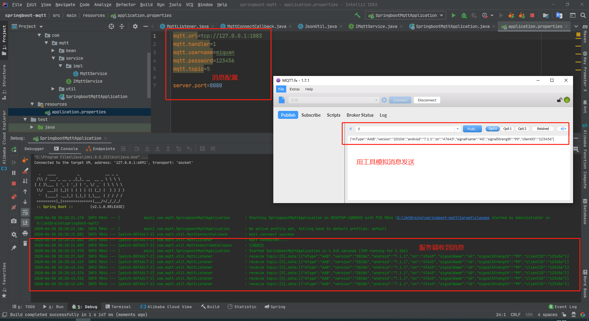

### 物联网设备使用的mq， 大多数的MQ消息队列都支持这个协议（MQTT,默认端口1883）
MQ 只要分为三部分：
- 服务处理端
- 消息发送端
- broken(消息收发中心)

### 服务端一般可以订单指定主题或全部主题#表示

### 客户端连接mq，需要指定topic主题。和服务器端收的topic相对应
>Publish/Subscribe (发布-订阅)模型，
>发布-订阅模型定义了如何向一个内容节点发布和订阅消息，这个内容节点称为topic(主题)。
>主题可以认为是消息传递的中介，消息发布这将消息发布到某个主题，而消息订阅者则从主题订阅消息。
>主题使得消息的订阅者与消息的发布者互相保持独立，不需要进行接触即可保证消息的传递，发布-订阅模型在消息的一对多广播时采用

使用MQ成本低。简单易用。低功耗。内存消耗不严重。

### 具体请看案例实现的pub/sub：
### 我这里使用的是Mosquitto http://mosquitto.org/download/ 
### 其实你可以仔细看下所有的消息队列中间件都支持mqtt协议，意味着你直接换broken就行。你也可以用ActiveMQ或者RabbitMQ

测试：
     1. 启动SpringbootMqttApplication
     2. 使用MQ发送工具模拟消息
     
效果可以看图 
     
我这个代码只是简单的使用，中间你可以按照实际的需求去做消息加密，自己实现一些特殊的功能。

喜欢就给个⭐Start⭐吧


#### 2020年7月23日 
MqttMessageHandler.java 
```
    /**
      *自动创建线程池，有缺点。消息发送时如果过多，会导致日志打印MQ发送消息失败问题，但是其实不是MQBroken的问题，是线程池的问题
      */ 
    private ExecutorService threadPools = Executors.newFixedThreadPool(300);

    //手动创建线程池，阿里开发规范推荐
    private ThreadPoolExecutor threadPools = new ThreadPoolExecutor(10, 20, 120, TimeUnit.SECONDS,
            new LinkedBlockingQueue<Runnable>());
```
